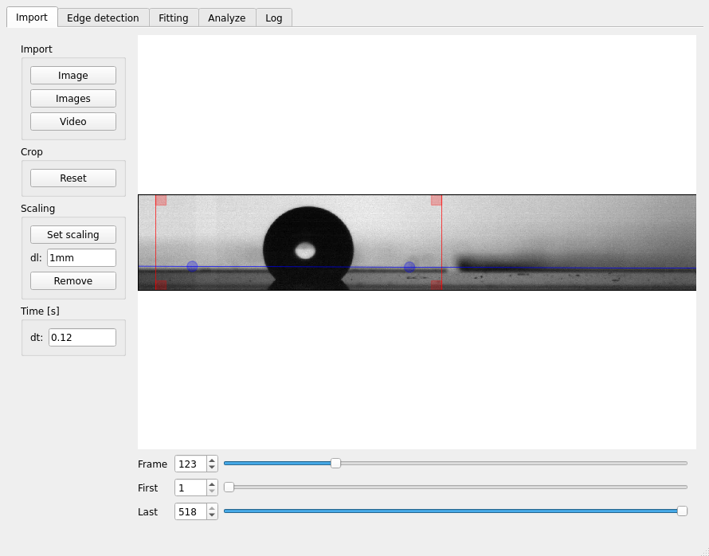
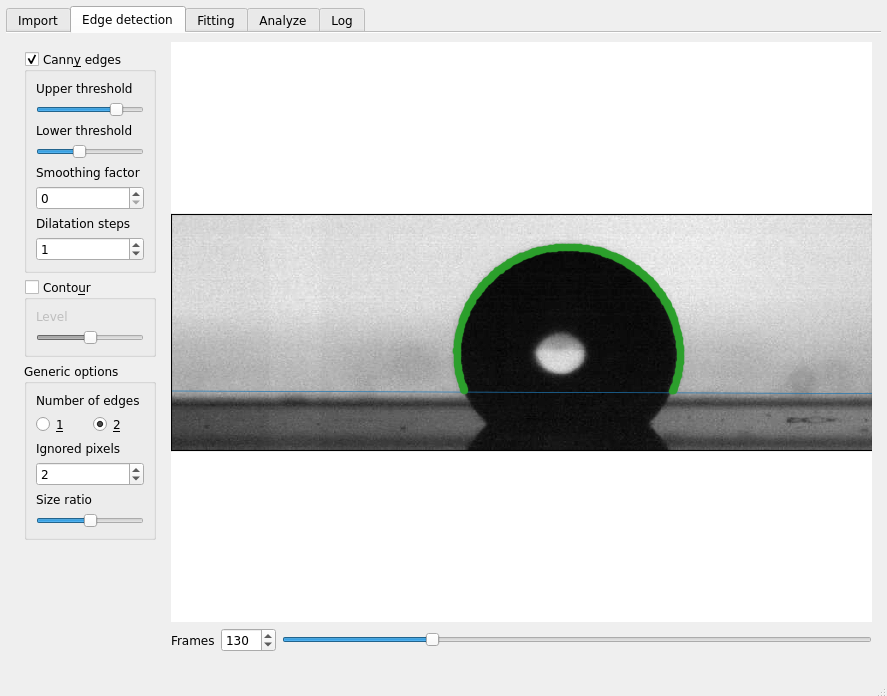
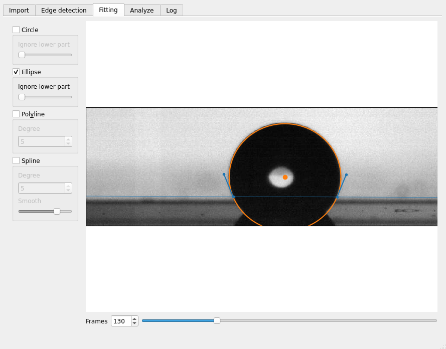
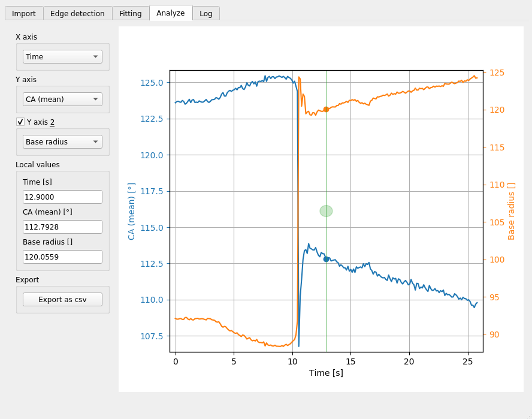

<div align="center">
  <br><br>
</div>


# pyDSA_gui: Graphical interface for drop shape analysis.


pyDSA_gui is a graphical interface for [pyDSA](https://framagit.org/gabylaunay/pyDSA_core), a drop shape analyzer.

## Installation<a name="installation"></a>

``pip install pyDSA_gui``

To update pyDSA_gui, use:

``pip install -U pyDSA_gui``

## Usage

Just fire up the GUI from the terminal (or anaconda console) with:

``pyDSA``

## Mandatory screenshots









## Documentation

pyDSA_gui is designed to be simple and straightforward to use.
If you don't understand the effect of an option,
please refers to the inline documentation of [pyDSA](https://framagit.org/gabylaunay/pyDSA_core),
where all the features are documented in details.

## Citing this software

If PyDSA_core have been usefull for you, please consider citing it:
```
Launay G. PyDSA_core: Drop shape analysis in Python, 2018-, https://framagit.org/gabylaunay/pyDSA_core [Online; accessed <today>].
```

bibtex entry:
``` bibtex
@Misc{launay_pydsa_2018,
  author =    {Gaby Launay},
  title =     {{PyDSA}: Drop shape analysis in {Python}},
  year =      {2018--},
  url = "https://framagit.org/gabylaunay/pyDSA_core",
  note = {[Online; accessed <today>]}
}

```

## Issues and bugs

If pyDSA_gui crashes or behaves abnormally, you can report [here](https://framagit.org/gabylaunay/pyDSA_gui/issues) or just send me an email at [gaby.launay@northumbria.ac.uk](mailto:gaby.launay@northumbria.ac.uk).
Any of the followings will greatly help me fix the issue:

- A description of the problem (as detailled as possible, for me to get it)
- The logs from the terminal
- A test case to reproduce the problem
